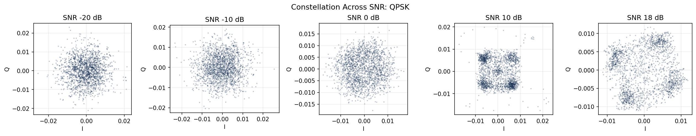
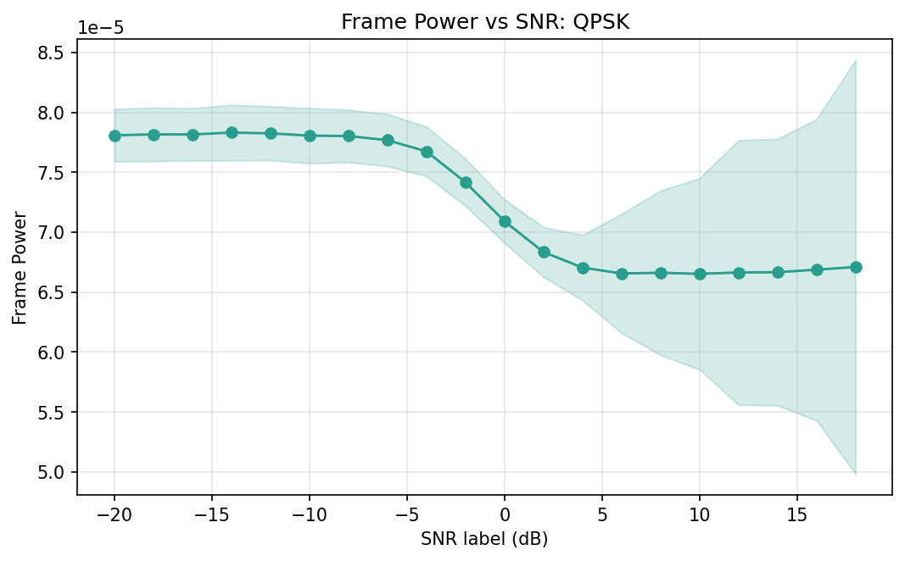
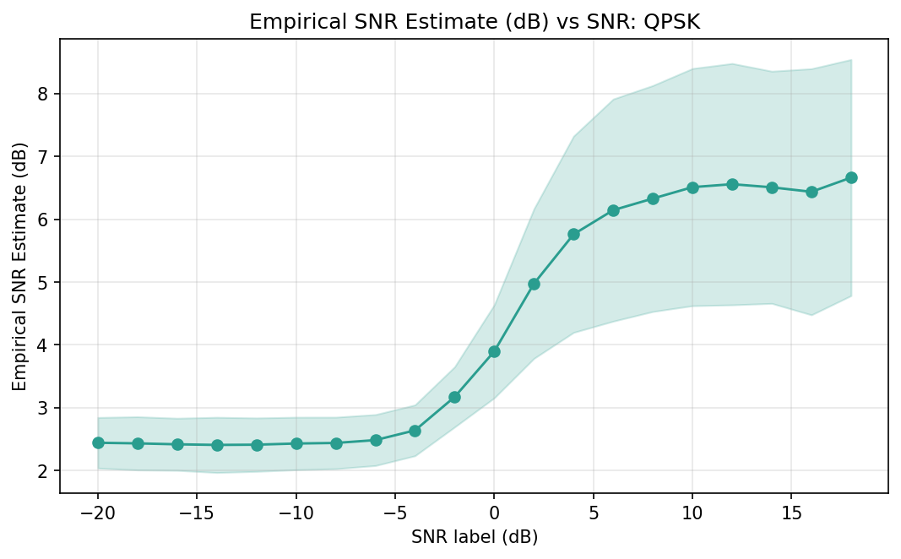

# l1-ml-signal-analytics

`l1sa` is a reusable Layer-1 signal analytics toolkit for the RadioML 2016.10A dictionary dataset (`(mod, snr) -> (N, 2, 128)` IQ frames), designed for ML diagnostics in mobile network SoC environments.

## Features

- Dataset summary and validation for RadioML pickle dict format
- EDA plots for class/SNR distribution
- Constellation diagnostics (single SNR and SNR sweep)
- Single-sided PSD analysis for complex IQ with:
  - window support: `rect`, `hann`, `hamming`, `blackman`
  - coherent-gain correction
  - ENBW reporting in CLI
  - window leakage demo
- Signal quality metrics:
  - per-sample and per-frame power
  - empirical SNR estimate per frame
  - EVM per frame for `QPSK`, `16QAM`, `64QAM` (nearest-point decisions)
- CSV artifacts for analytics-ready outputs from quality/EVM/PSD commands

## Project Layout

```text
src/l1sa/
  __init__.py
  __main__.py
  io.py
  eda.py
  spectral.py
  metrics.py
  viz.py
  cli.py
```

## Install

```bash
python -m pip install -e .
```

## Dataset

The RadioML 2016.10A dataset is **not included** in this repository.
Download it separately and place it at:

```text
data/RML2016.10a_dict.pkl
```

## Required CLI Commands

```bash
l1sa summary --pkl data/RML2016.10a_dict.pkl

l1sa plot-constellation --pkl data/RML2016.10a_dict.pkl --mod QPSK --snr -10 --n 2000
# -> outputs/constellation_QPSK_-10.png

l1sa plot-psd --pkl data/RML2016.10a_dict.pkl --mod QPSK --snr -10 --window hann
# -> outputs/psd_QPSK_-10_hann.png

l1sa window-demo --pkl data/RML2016.10a_dict.pkl --mod QPSK --snr 0
# -> outputs/window_demo_QPSK_0.png

l1sa inspect --pkl data/RML2016.10a_dict.pkl --mod QPSK --snr 0 --idx 0 --window hann --outdir outputs
# -> outputs/inspect_QPSK_0_idx0_hann.png
# -> outputs/inspect_psd_QPSK_0_idx0_hann.csv
```

Each command prints a short summary of generated outputs and key parameters.
`plot-quality` now also saves `quality_power_vs_snr.csv` and `quality_snr_est_vs_snr.csv`, and `plot-evm-snr` now saves per-modulation `evm_vs_snr_<MOD>.csv`.

## Acceptance-Core Figure Commands

Generate all 5 core figures end-to-end:

```bash
l1sa make-core-figures --pkl data/RML2016.10a_dict.pkl --mod QPSK --snrs -20 -10 0 10 18
```

This creates:

- `outputs/class_snr_distribution.png`
- `outputs/constellation_sweep_QPSK.png`
- `outputs/psd_sweep_QPSK_hann.png`
- `outputs/window_demo_QPSK_0.png`
- `outputs/evm_vs_snr_16QAM-64QAM-QPSK.png`

You can also run them separately:

```bash
l1sa plot-distribution --pkl data/RML2016.10a_dict.pkl
l1sa plot-constellation-sweep --pkl data/RML2016.10a_dict.pkl --mod QPSK --snrs -20 -10 0 10 18 --n 2000
l1sa plot-psd-sweep --pkl data/RML2016.10a_dict.pkl --mod QPSK --snrs -20 -10 0 10 18 --window hann
l1sa plot-evm-snr --pkl data/RML2016.10a_dict.pkl --mods QPSK 16QAM 64QAM
```

## Figure Gallery

### Class/SNR Distribution

This summarizes class balance and sample density across SNR bins. It is useful as a first sanity check before training.

### Constellation Sweep (QPSK)

This view shows how the constellation tightens as label SNR increases. It quickly highlights channel/noise effects across conditions.

### PSD Sweep (QPSK, Hann)

This compares average spectra over multiple SNR points using a consistent window. It helps verify spectral shape stability and noise-floor trends.

### Window Leakage Demo

This contrasts rectangular and tapered windows on the same frame. It makes main-lobe width vs side-lobe suppression tradeoffs visible.

### Quality: Power vs SNR

This curve tracks average frame power and variation against SNR labels. It provides a compact quality-control metric for dataset consistency.

### Quality: Estimated SNR vs Label SNR

This compares empirical SNR estimates against label SNR values. It helps check how well measured quality follows annotation.

### EVM vs SNR

This shows modulation-wise EVM behavior over SNR and supports side-by-side robustness comparison.

## Reproduce

Generate the core figures:

```bash
python -m l1sa make-core-figures --pkl data/RML2016.10a_dict.pkl --outdir outputs
```

## Metric Notes

- Empirical SNR estimator:
  - `QPSK/16QAM/64QAM`: decision-directed estimate from nearest constellation points
  - other modulations: PSD-floor estimate (lower-quantile spectral floor)
- EVM limitations:
  - nearest-point hard decisions only
  - assumes symbol-synchronous samples
  - no timing recovery/equalization

## Output Convention

All figures are saved to `outputs/` with deterministic filenames based on command arguments.
