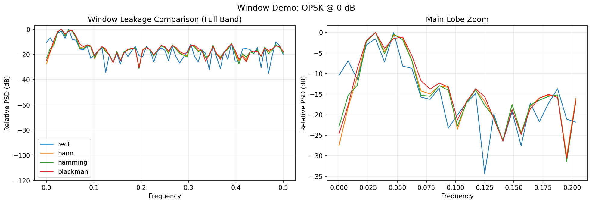
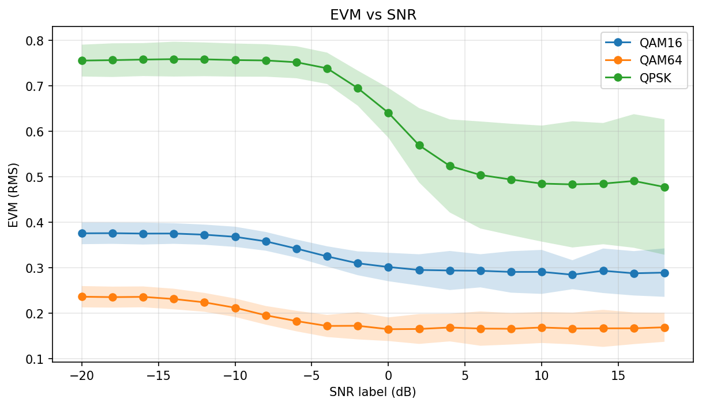
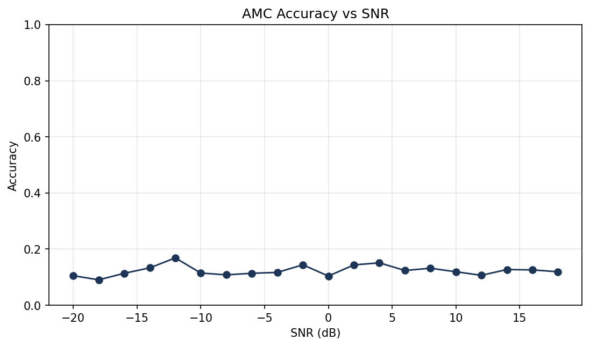

# l1-ml-signal-analytics

`l1sa` is a Layer-1 signal analytics toolkit for the RadioML 2016.10A IQ dataset. It is built for pre-ML diagnostics in L1/SoC workflows, so teams can validate signal quality, spectral behavior, and label consistency before model training.

## Features

- Dataset summary and class/SNR distribution diagnostics
- Constellation plotting for single `(mod, snr)` and SNR sweeps
- Single-sided PSD analysis for complex IQ with selectable windows
- Window leakage demo (`rect`, `hann`, `hamming`, `blackman`)
- Signal quality metrics: frame power and empirical SNR estimate
- EVM vs SNR curves for digital modulations
- CSV artifacts for analytics workflows (`quality`, `evm`, `psd`, `inspect`)
- `inspect` command for one-frame waveform + constellation + PSD view
- Optional tiny PyTorch AMC baseline with accuracy-vs-SNR output

## Quickstart

Install in editable mode:

```bash
python -m pip install -e .
```

Dataset location (not included in this repo):

```text
data/RML2016.10a_dict.pkl
```

Generate the core figures:

```bash
python -m l1sa make-core-figures --pkl data/RML2016.10a_dict.pkl --outdir outputs
```

Base toolkit commands above work without PyTorch.

## Commands

```bash
python -m l1sa summary --pkl data/RML2016.10a_dict.pkl
python -m l1sa inspect --pkl data/RML2016.10a_dict.pkl --mod QPSK --snr 0 --idx 0 --outdir outputs
python -m l1sa window-demo --pkl data/RML2016.10a_dict.pkl --mod QPSK --snr 0 --outdir outputs
python -m l1sa plot-psd-sweep --pkl data/RML2016.10a_dict.pkl --mod QPSK --snrs -20 -10 0 10 18 --window hann --outdir outputs
python -m l1sa plot-evm-snr --pkl data/RML2016.10a_dict.pkl --mods QPSK 16QAM 64QAM --outdir outputs
```

## Optional: AMC baseline (PyTorch)

Install optional ML dependency:

```bash
pip install -r requirements-ml.txt
```

Use the appropriate PyTorch build for your system (CPU/CUDA) from the official install guide.

Run the baseline:

```bash
python -m l1sa amc-baseline --pkl data/RML2016.10a_dict.pkl --outdir outputs
```

The baseline uses per-frame normalization and defaults to `--snr-min -10 --snr-max 18`, which avoids the noisiest bins where labels are effectively ambiguous. A healthy run should show accuracy increasing with SNR.

Fast demo (CPU-friendly):

```bash
python -m l1sa amc-baseline --pkl data/RML2016.10a_dict.pkl --outdir outputs --max-per-snr 500 --epochs 5 --model cnn
```

Better run (slower, stronger):

```bash
python -m l1sa amc-baseline --pkl data/RML2016.10a_dict.pkl --outdir outputs --max-per-snr 2000 --epochs 15 --model cldnn
```

Outputs include:
- `outputs/amc_accuracy_vs_snr.png`
- `outputs/amc_accuracy_vs_snr.csv`
- `outputs/amc_overall_metrics.json`
- optional `outputs/amc_confusion_snr_<SNR>.png`

## Figures


Class and SNR coverage overview used as an initial dataset sanity check.


QPSK constellation behavior across SNR labels.


PSD overlays across SNR values to compare spectral floor and shape.


Leakage tradeoff comparison across common FFT windows.


Average frame power trend versus SNR label.


EVM curves across SNR for multiple modulations.


Improved AMC baseline showing the expected rising accuracy trend as SNR increases.

## Testing

```bash
pytest -q
```

## Dataset Note

The RadioML 2016.10A dataset is not committed to this repository because of size. Download it separately and place it under `data/RML2016.10a_dict.pkl`.
